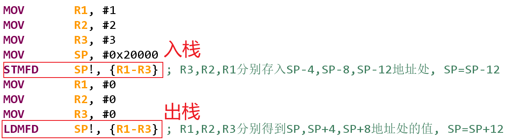

---
tags:
  - ARM
  - 汇编
  - 内存访问
---

读内存指令LDR/LDM：参考《DEN0013D_cortex_a_series_PG.pdf》P340、P341
写内存指令STR/STM：参考《DEN0013D_cortex_a_series_PG.pdf》P377、P378
LDR：Load Register；LDM：Load Multiple Register；
STR：Store Register；STM：Store Multiple Register。
addr_mode:
IA - Increment After,  每次传输后才增加Rn的值(默认,可省)
IB - Increment Before, 每次传输前就增加Rn的值(ARM指令才能用)
DA – Decrement After,  每次传输后才减小Rn的值(ARM指令才能用)
DB – Decrement Before, 每次传输前就减小Rn的值

! : 表示修改后的Rn值会写入Rn寄存器,
如果没有"!", 指令执行完后Rn恢复/保持原值

^ : 会影响CPSR, 在讲异常时再细讲

---

示例：
MOV		R0, #0x20000
MOV		R1, #0x10
MOV		R2, #0x12
STR		R2, [R0]                 ; R2的值存到R0所示地址
STR		R2, [R0, #4]          ; R2的值存到R0+4所示地址
STR		R2, [R0, #8]!         ; R2的值存到R0+8所示地址, R0=R0+8
STR		R2, [R0, R1]          ; R2的值存到R0+R1所示地址
STR		R2, [R0, R1, LSL #4]  ; R2的值存到R0+(R1<<4)所示地址
STR		R2, [R0], #0X20           ; R2的值存到R0所示地址, R0=R0+0x20
MOV		R2, #0x34
STR		R2, [R0]                          ; R2的值存到R0所示地址
LDR		R3, [R0], +R1, LSL #1 ; R3的值等于R0+(R1<<1)所示地址上的值

---

addr_mode:
IA - Increment After,  每次传输后才增加Rn的值(默认,可省)
IB - Increment Before, 每次传输前就增加Rn的值(ARM指令才能用)
DA – Decrement After,  每次传输后才减小Rn的值(ARM指令才能用)
DB – Decrement Before, 每次传输前就减小Rn的值

! : 表示修改后的Rn值会写入Rn寄存器,
如果没有"!", 指令执行完后Rn恢复/保持原值

^ : 会影响CPSR, 在讲异常时再细讲
示例：源码为 “source\02_录制视频时现场编写的源码\02_VisUAL\ldr_str.S”

MOV		R1, #1
MOV		R2, #2
MOV		R3, #3
MOV		R0, #0x20000
STMIA	R0,  {R1-R3}               ; R1,R2,R3分别存入R0,R0+4,R0+8地址处
ADD	R0, R0, #0x10
STMIA	R0!, {R1-R3}              ; R1,R2,R3分别存入R0,R0+4,R0+8地址处, R0=R0+3*4

---

addr_mode:
IA - Increment After,  每次传输后才增加Rn的值(默认,可省)
IB - Increment Before, 每次传输前就增加Rn的值(ARM指令才能用)
DA – Decrement After,  每次传输后才减小Rn的值(ARM指令才能用)
DB – Decrement Before, 每次传输前就减小Rn的值

! : 表示修改后的Rn值会写入Rn寄存器,
如果没有"!", 指令执行完后Rn恢复/保持原值

^ : 会影响CPSR, 在讲异常时再细讲

源码为 “source\02_录制视频时现场编写的源码\02_VisUAL\stm.S”

---

根据栈指针指向，可分为满(Full)/空(Empty)：
满SP指向最后一个入栈的数据，需要先修改SP再入栈
空SP指向下一个空位置，先入栈再修改SP

根据压栈时SP的增长方向，可分为增/减：
增(Ascending)：SP变大
减(Descending)：SP变小

组合后，就有4种方式：
满增、满减，
空增，空减。

常用的“满减”：
入栈时用STMDB，也可以用STMFD，作用一样；
出栈时用LDMIA，也可以用LDMFD，作用一样。

示例：源码为 “source\02_录制视频时现场编写的源码\02_VisUAL\stack.S”

STMFD sp!, {r0-r5} ; Push onto a Full Descending Stack
LDMFD sp!, {r0-r5} ; Pop from a Full Descending Stack

