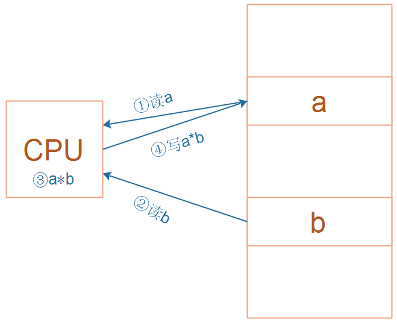
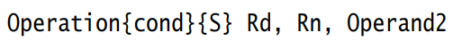

---
tags:
  - ARM
  - 汇编
  - 数据处理指令
---

ARM芯片属于精简指令集计算机(RISC：Reduced Instruction Set Computing)，它所用的指令比较简单，有如下特点：
① 对内存只有读、写指令
② 对于数据的运算是在CPU内部实现
对于左图所示的乘法运算a = a * b，
在RISC中要使用4条汇编指令：
① 读内存a
② 读内存b
③ 计算a*b
④ 把结果写入内存
注意：
所有的数据都是在CPU内部处理的！

---

参考《DEN0013D_cortex_a_series_PG.pdf》P70、《ARM Cortex-M3与Cortex-M4权威指南.pdf》第5章
以“数据处理”指令为例，UAL汇编格式为：
Operation表示各类汇编指令，比如ADD、MOV；如下图：
cond有多种取值，如下：

---

加法指令ADD：
ADD  R1, R2, R3         ; R1 = R2 + R3
ADD  R1, R2, #0x12   ; R1 = R2 + 0x12

2. 减法指令SUB:
SUB  R1, R2, R3         ; R1 = R2 - R3
SUB  R1, R2, #0x12   ; R1 = R2 - 0x12

3. 位操作：
;  VisUAL里不支持(1<<4)这样的写法，写成：0x10
AND R1, R2, #(1<<4)   ;  位与，R1 = R2 & (1<<4)
AND  R1, R2, R3           ; 位与，R1 = R2 & R3
BIC  R1, R2, #(1<<4)    ; 清除某位，R1 = R2 & ~(1<<4)
BIC  R1, R2, R3             ; 清除某位，R1 = R2 & ~R3
ORR   R1, R2, R3

4. 比较：
CMP R0, R1                ;  比较R0-R1的结果
CMP R0, #0x12            ; 比较R0-0x12的结果
TST  R0, R1                 ;  测试 R0 & R1的结果
TST  R0, #(1<<4)        ;  测试 R0 & (1<<4)的结果

---

