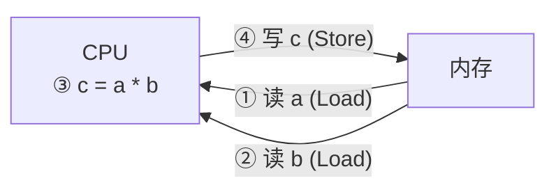

---
tags:
---
# [RISC](../01_P/ARM%20架构/04_地址空间、RISC与CISC架构解析.md)

ARM芯片属于精简指令集计算机(RISC：Reduced Instruction Set Computing)，它所用的指令比较简单，有如下特点：
1. 对内存只有读、写指令
2. 对于数据的运算是在CPU内部实现
3. 怎么实现函数？怎么调用函数？



# 跳转指令简介

C程序中，函数A调用函数B的实质是什么？

```c
void A()
{
      int a = 10;
      B(a);
      printf(“ok”);
}
```

实质是：跳转去执行函数B的代码，函数B执行完后，还要回到函数A继续执行后面的代码。

对应的汇编指令就是跳转指令。

# 分支/跳转指令

参考《DEN0013D_cortex_a_series_PG.pdf》P327、P328、P329

核心指令是B、BL：

B：Branch，跳转

BL：Branch with Link，跳转前先把返回地址保持在LR寄存器中

BX：Branch and eXchange，根据跳转地址的BIT0切换为ARM或Thumb状态(0：ARM状态，1：Thumb状态)  
BLX：Branch with Link and eXchange

 根据跳转地址的BIT0切换为ARM或Thumb状态(0：ARM状态，1：Thumb状态)


# 练习几条跳转指令

1. B指令示例：源码为 “source\02_录制视频时现场编写的源码\02_VisUAL\b.S”

```
B  Delay
Delay
MOV  R0, #1000
Loop
SUBS  R0, R0, #1
BNE  Loop
MOV  R1, #1
```

2. BL指令示例：源码为 “source\02_录制视频时现场编写的源码\02_VisUAL\bl.S”

```
BL  Delay    ; 跳转前把返回地址保持在LR寄存器里
MOV  R1, #1
Delay
MOV  R0, #1000
Loop
SUBS  R0, R0, #1
BNE  Loop
MOV  PC, LR    ; 把LR赋给PC，返回
```

# 也可以给PC直接赋值

源码为 “source\02_录制视频时现场编写的源码\02_VisUAL\pc.S”

```
ADR  LR, Ret    ; 伪指令，读取Ret标号的地址赋给LR，这是返回地址
ADR  PC, Delay  ; 伪指令，读取Delay标号的地址赋给PC，直接跳转
Ret
MOV  R1, #1
Delay
MOV  R0, #1000
Loop
SUBS  R0, R0, #1
BNE  Loop
MOV  PC, LR    ; 把LR赋给PC，返回
```