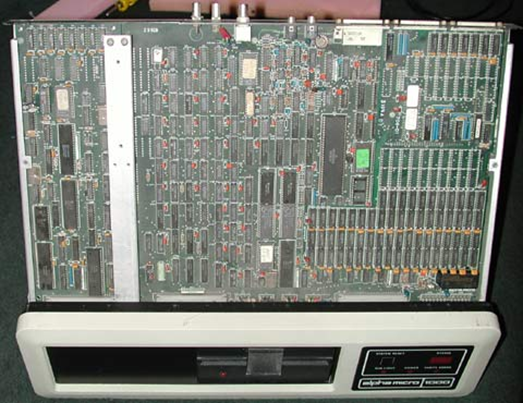
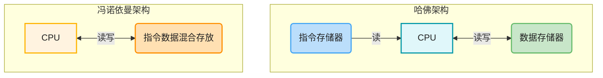
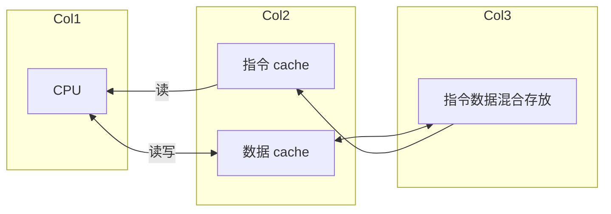
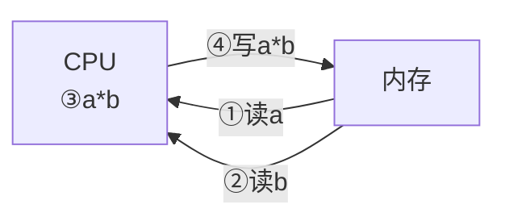

---
tags:
  - arm
---
# MPU、MCU、SoC、Application Processors的概念

[microcontrollers vs microprocessors what's the difference](https://www.microcontrollertips.com/microcontrollers-vs-microprocessors-whats-difference/)

[The difference between microprocessors and application processors](https://www.microcontrollertips.com/difference-microprocessors-application-processors/)

在一个电子系统中，处理器占据最重要的位置，被称为中央处理器单元：CPU(Central Processing Unit)。它从IO设备读取数据，处理，然后显示出来。

- CPU的发展有两个路线：MPU、MCU。
	- MPU 只是一个处理器，需要搭配内存等非常多的其他外设才可以构成一个系统；
	- MCU 内部有处理器、内存、Flash及其他模块，仅仅需要搭配少量外设就可以构成一个系统。

MPU这一路线，在上世纪80年代非常流行，那时的微型计算机、游戏机都是使用MPU。比如Motorola公司的68000芯片就是一款主流的微处理器(MPU)。下图是一款Alpha Micro AM-1000系列的微型计算机电路板，电路板右侧中间最大的芯片就是MPU 68000。

后来，虽然 x86 成为 PC 领域的主流，但 MPU 的概念在嵌入式领域以高性能 `Application Processors` (如 ARM Cortex-A 系列) 的形式得到了延续和发展，广泛应用于智能设备。这类CPU也越来越复杂，称之为“微处理器”似乎不恰当了。在个人电脑领域，可以看到类似下图的主板。主板上插上CPU、内存条、声卡等等就构成了一台计算机。整个主板体积庞大、制造复杂：

MCU这一路线，就是把CPU、内存、Flash都集中在一个芯片上，它再搭配其他外设备就可以构建一个完整的系统。MCU的发展经历过8位8051单片机、16位AVR单片机、32位STM单片机等等：

我们使用的51单片机、STM32单片机，一般都只是用来处理比较简单的事务，应用场景比较单一。我们使用的手机，里面的主芯片更加复杂，它既含有CPU，也含有用于数据处理的DSP、用于图形显示的GPU。使用这类主芯片设计出来的电路板更加复杂，它的性能甚至不弱于个人电脑：

为了跟个人电脑相区分，这些使用含有CPU电子产品，被称为嵌入式系统、嵌入式产品、嵌入式板卡。

嵌入式板卡就是一台形状不一样的电脑，跟电脑相比，可以引入几个概念：

## CPU(Central Processing Unit)

中央处理器，在PC机它是一个独立的芯片。

在嵌入系统中，它是芯片里的一个单元，跟其他模块比如USB、UART、音频组成一个芯片。

## MPU(Mircro Processor Unit)

微处理器单元，其作用等同于在PC上使用的CPU，它也只仅仅是一个处理器，需要配合内存、Flash等外设才可以使用。

现在，在个人电脑领域，我们通常直接称其为 CPU。但在嵌入式领域，如高性能智能硬件中，`Application Processors` (本质上仍是微处理器) 仍被广泛使用，且经常被称为 MPU 或 SoC。

## MCU(Micro Controller Unit)

微控制器单元，有时又称为单片机。

MCU内部集成了处理器和各类模块，比如USB控制器、UART控制器、内存、Flash等等。只需要外接少量的器件，就可以搭建一个电子系统。

C51芯片、STM32等芯片，都是MCU。

MCU芯片内部的内存或Flash，容量在几KB、几百KB、几MB的量级，一般不再需要外接内存或Flash。

## Application Processors

手机中的主芯片跟MCU类似，也是集成了处理器和各类模块。但是它的性能已经极大提升，可以外接几GB的内存 (DRAM/LPDDR) 和几GB甚至更大的闪存 (Flash/eMMC/UFS)。

在手机中，这个主芯片一般用来处理显示、输入，运行用户的程序，所以称它为“Application Processors”。

“Application Processors”的概念可以扩展到其他场景，不再局限于手机。

跟MCU进行比较，Application Processors有以下不同：

### 集成了更多的模块

Application Processors内部集成了更多的模块，比如用于数据处理的DSP、用于图形显示的GPU，甚至有多个处理器。

这里又引入一个概念“片上系统”(SoC，System on a Chip)，SoC 的本意是在一个芯片上集成一个电子系统的主要功能模块，实现一个完整的产品或子系统所需的大部分功能。

但是这个概念在日常使用中比较宽泛：MCU芯片也可以称为SoC，Application Processors也可以称为SoC，即使它们还必须外接内存/Flash等外设才可以运行。

在以前的文档中涉及SoC时，意指比较复杂的系统；这时候MCU不属于SoC，因为MCU比较简单。但是时代在发展，MCU也越来越复杂了，所以把MCU也当作SoC也是可以的。

在手机电路板中，可用空间非常小。Application Processors还需要搭配内存芯片才可以使用，于是发展出了一种名为package-on-package (PoP)的工艺：在电路板上先焊接Application Processors，在Application Processors上面再焊接内存芯片，即2个芯片叠在一起。

### 运行的操作系统不同

MCU上一般不运行操作系统，或是运行一些资源耗费较小的小型实时操作系统(RTOS)。

MCU一般用来处理实时性要求高的事情，处理一些比较简单的事情。

Application Processors基本上都会运行比较复杂的操作系统(比如Linux)，在操作系统上运行多个APP。

## 小结

| 特性       | MPU (微处理器)                             | MCU (微控制器/单片机)                                    | Application Processor                 | SoC (片上系统)                    |
| -------- | -------------------------------------- | ------------------------------------------------- | ------------------------------------- | ----------------------------- |
| 集成度 (功能) | **低**。仅 CPU 核心。                        | **高**。CPU + 片上内存/Flash + **大量外设** (UART/ADC/I2C)。 | **极高**。高性能 CPU + **GPU/DSP** + 高速接口。  | **泛指**。将系统主要功能集成到单芯片的设计理念。    |
| 内存/存储    | 必须**外接** DRAM 和 Flash。                 | **内部集成** SRAM/Flash (KB/MB 级)，通常**不需**外接主内存。      | 必须**外接**大容量 DRAM (GB 级) 和 Flash/eMMC。 | 取决于集成的是 MCU 还是 AP。            |
| 性能等级     | 中等到高 (取决于核心)。                          | **低到中**。强调实时控制。                                   | **极高**。强调运算和多媒体处理。                    | 可覆盖所有等级。                      |
| 典型代表     | 早期 68000；现代高性能嵌入式芯片中的 **Cortex-A 核心**。 | **STM32 (Cortex-M)**、8051、低端 RISC-V 芯片。           | **手机主芯片**、**树莓派主芯片**、高性能 HMI 芯片。      | **所有** MCU 和 AP 芯片在广义上都是 SoC。 |
| 操作系统     | 需要运行 OS。                               | 通常运行资源消耗小的 **RTOS (FreeRTOS/RT-Thread)** 或无 OS。   | 运行复杂 OS (**Linux/Android**)，支持多应用并发。  | 取决于具体芯片。                      |
| 关键区别     | **计算核心**，必须外接主存。                       | **控制核心**，自带主存和外设。                                 | **高性能计算核心**，增强了多媒体能力。                 | **设计理念**，集成度高。                |

# 哈佛架构与冯诺依曼架构

CPU架构可以分为哈佛架构与冯诺依曼架构。哈佛架构中指令与数据分开存放，CPU可以同时读入指令、读写数据。冯诺依曼架构中指令、数据混合存放在同一存储空间，共享同一套总线，因此 CPU 只能分时地依次读取指令或读写数据，不可同时操作指令和数据。

ARM公司的芯片，ARM7及之前的芯片是冯诺依曼架构，ARM7之后使用“改进的哈佛架构”。“改进的哈弗结构”如下所示：

在“改进的哈佛架构”里，指令和数据在外部存储器中混合存放；CPU运行时，从指令cache中获得指令，从数据cache中读写数据。

## 小结

| 特性   | 冯诺依曼架构 (Von Neumann Architecture)            | 哈佛架构 (Harvard Architecture)                                                                                        |
| ---- | -------------------------------------------- | ------------------------------------------------------------------------------------------------------------------ |
| 存储结构 | **指令和数据** 混合存放在**同一存储空间**。                   | **指令和数据** 分开存放在**不同的存储空间**。                                                                                        |
| 总线结构 | **一套**共享的总线（地址总线和数据总线）。                      | **两套**独立的总线（指令总线和数据总线）。                                                                                            |
| 数据吞吐 | CPU 必须**分时**地读取指令或读写数据，**不可同时进行**（存在冯诺依曼瓶颈）。 | CPU 可以**同时**读取指令和读写数据，**并行操作**。                                                                                    |
| 典型应用 | **PC 机的 CPU** (尽管有 Cache 优化)。                | **MCU (单片机)**、**DSP (数字信号处理器)** 等强调速度和并行性的系统。                                                                      |
| 改进型  | N/A                                          | 现代高性能 CPU (如 ARM Cortex-A) 通常采用**“改进的哈佛架构”**，通过在片内使用**两套 Cache** (指令 Cache 和数据 Cache) 来实现并行访问，但最终仍汇集到外部的冯诺依曼混合存储器。 |

# 指令集：CISC和RISC

[CISC与RISC指令集对比](https://blog.csdn.net/gongxsh00/article/details/81048671)

CISC(Complex Instruction Set Computer，复杂指令集计算机) 和 RISC(Reduced Instruction Set Computer，精简指令集计算机)是两大类主流的CPU指令集类型。

其中CISC以Intel、AMD的X86 CPU为代表，而RISC以ARM、IBM Power为代表。开源的RISC-V也是RISC指令集。

RISC的设计初衷针对CISC CPU复杂的弊端，选择一些可以在单个CPU周期完成的指令，以降低CPU的复杂度，将复杂性交给编译器。

举一个例子，下图是实现这样的乘法运算：a = a * b。它需要4个步骤：读出a的值、读出b的值、相乘、写结果到a。

使用CISC提供的乘法指令，只需要一条指令即可完成这4步操作。当然，这一个指令需要多个CPU周期才可以完成。

而RISC不提供“一站式”的乘法指令，需调用四条单CPU周期指令完成两数相乘：内存a加载到寄存器，内存b加载到寄存器，两个寄存器中数相乘，寄存器结果存入内存a。

按照此思路，早期的设计出的RISC指令集，指令数是比CISC少些。后来，很多RISC的指令集中指令数反超了CISC。因此，应该根据指令的**复杂度**而非数量来区分两种指令集。

当然，CISC也是要通过操作内存、寄存器、运算器来完成复杂指令的。它在实现时，是将复杂指令转换成了一个微程序，微程序在制造CPU时就已存储于微码存储器。一个微程序包含若干条微指令（也称微码），执行复杂指令时，实际上是在执行一个微程序。这也带来两种指令集的一个差别，微程序的执行是不可被打断的，而RISC指令之间可以被打断，所以理论上RISC可**更快响应中断**。

在此，总结一下CISC和RISC的主要区别：

1. 指令能力：
	- CISC的指令能力强，单多数指令使用率低却增加了CPU的复杂度，指令是可变长格式；
	- RISC的指令大部分为单周期指令，指令长度固定。
	- RISC 对内存的操作仅限于 `load` (加载数据到寄存器) 和 `store` (将寄存器数据存回内存) 指令，数据的运算（如加减乘除）都必须在 CPU 的寄存器中完成。
2. 寻址方式：
	- CISC支持多种寻址方式；RISC支持的寻址方式少；
3. 实现方式：
	- CISC通过微程序控制技术实现；
	- RISC增加了通用寄存器，硬布线逻辑控制为主，采用流水线方式执行。
4. 研发周期：
	- CISC的研制周期长
	- RISC 硬件设计简单，主要通过增加通用寄存器和采用流水线技术来提高性能，但对编译器优化要求高。

[ARMv8 架构与指令集.学习笔记](https://blog.csdn.net/forever_2015/article/details/50285865)

[一篇文章读懂Armv8 AArch64](https://www.jianshu.com/p/65afe6e37764)

## 小结

| 特性       | CISC (复杂指令集计算机 - Complex Instruction Set Computer) | RISC (精简指令集计算机 - Reduced Instruction Set Computer)                    |
| -------- | -------------------------------------------------- | --------------------------------------------------------------------- |
| 指令设计 | 指令**功能强大**、复杂，可以执行多步操作（如一次完成内存读/写和运算）。             | 指令**功能单一**，大部分指令都能在**单个 CPU 周期**内完成。                                  |
| 指令数量 | 早期数量多，现代**不以数量取胜**，但指令**复杂度高**。                    | 数量相对较少或与 CISC 相近，但指令**复杂度低**。                                         |
| 访存操作 | 支持多种复杂的**寻址方式**，可以直接用一条指令进行内存到内存的运算。               | 对内存仅支持 **`load`** (加载到寄存器) 和 **`store`** (从寄存器存储) 操作，运算必须在**寄存器**中完成。 |
| 控制方式 | 通过 **微程序控制** (将复杂指令转换为一系列微指令执行)。                   | 以 **硬布线逻辑控制** 为主，大量使用**通用寄存器**和**流水线**技术。                             |
| 中断响应 | 执行微程序时**不可被打断**，响应中断相对慢。                           | 指令间可被打断，理论上可**更快响应中断**。                                               |
| 典型代表 | **Intel/AMD 的 x86 系列 CPU**。                        | **ARM**、**RISC-V**、IBM Power。                                         |
