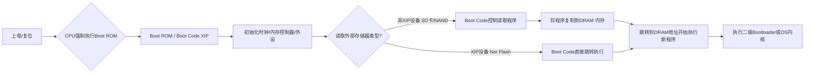

---
tags:
  - arm
---
# 核心概念：存储器与代码执行

嵌入式系统启动的关键是 **CPU 如何访问程序代码**。存储器分为两大类：

| 存储器类型    | XIP (eXecute In Place) 就地执行            | 非 XIP (Non-XIP) 非就地执行                      |
| -------- | -------------------------------------- | ------------------------------------------ |
| 核心含义 | CPU 可**直接寻址和执行代码**。                    | CPU **无法直接执行**。代码必须先**搬运到 RAM** 才能运行。      |
| 典型代表 | **Nor Flash**、片内 **Boot ROM**、片内 SRAM。 | **NAND Flash**、**SD 卡**、eMMC、多数 SPI Flash。 |
| 特点   | **速度快**，可直接作为程序存储区。                    | **容量大，成本低**，必须配合控制器进行数据搬运。                 |

# 嵌入式系统（SoC）启动流程的核心秘密

嵌入式 SoC 高度集成，其启动秘密藏在芯片内部的 **Boot ROM**（片内 XIP 存储器）。

系统从 **非 XIP 设备**（如 SD 卡、NAND）启动的步骤：
1. **上电瞬间：** CPU 的 PC 寄存器被强制指向芯片内部固化的 **Boot ROM** 地址。
2. **执行 Boot Code (Primary Bootloader)：** CPU 运行 Boot ROM 中的程序（Boot Code）。
    - Boot ROM 是一个 **XIP 设备**。
3. **Boot Code 的任务（三步走）：**
    - **硬件初始化：** 初始化时钟、内存控制器 (DDR) 等必要硬件。
    - **程序搬运 (Loader)：** 根据硬件跳线，从外部非 XIP 设备（如 SD 卡）中找到程序（通常是二级 Bootloader 或 OS 内核）。
    - **复制程序：** 将找到的程序复制到**已初始化的 DRAM 内存**中。
4. **最终执行：** Boot Code 将 PC 指针跳转到 DRAM 中新程序的地址，开始执行该程序（如 U-Boot 或 OS 内核）。

---

# Boot Code 关键职责（以 SD 卡启动为例）

Boot Code 在执行程序搬运时，需要解决以下三个问题：

1. **从哪里启动 (启动源选择)**：
    - 通过**硬件跳线/引脚配置**，决定从哪个外设启动。
2. **程序放哪里 (加载地址)**：
    - 读取程序文件头信息，获取**目标内存地址**和**程序长度**，或复制到**内存固定预设位置**。
3. **程序怎么存 (文件格式)**：
    - 使用**原始二进制 (raw bin)** 格式，或作为**文件保存在分区**中。
