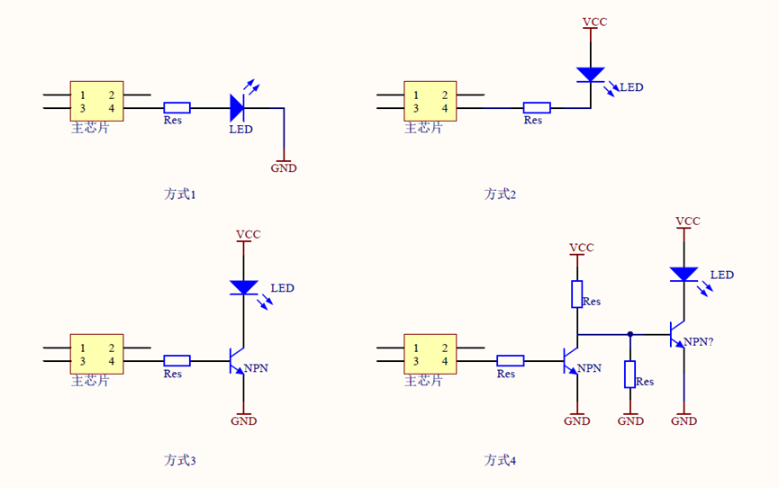
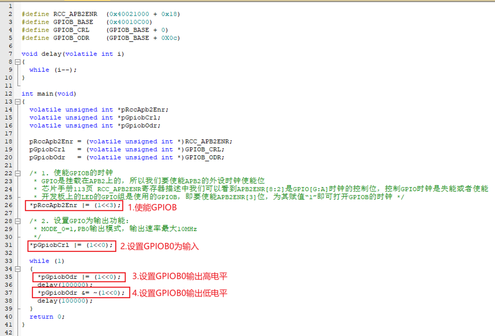
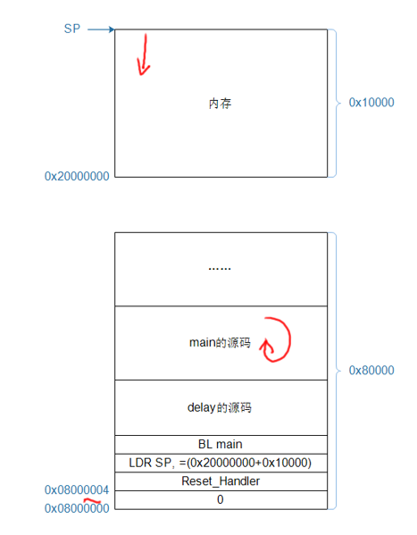

---
tags:
  - arm
---


当初学 C 语言时，我们以 “Hello World” 入门；而在 ARM 嵌入式开发中，最经典的入门程序就是 点亮一颗 LED。

要点亮一个 LED，我们需要完成三件事：

1. 查看原理图：确定哪一个 GPIO 引脚控制 LED
2. 查看芯片手册：确定如何配置这个引脚
3. 编写程序：让引脚输出高电平或低电平，从而改变 LED 状态

下面按逻辑顺序，从硬件到寄存器，再到代码思路逐步展开。

# 一、理解原理图：LED 如何被点亮

LED 的驱动方式主要有两类：

- **高电平点亮**（输出高 → LED亮）
- **低电平点亮**（输出低 → LED亮）

不同电源电压、不同芯片驱动能力，会带来不同的电路组合，因此常见四种方式：



方式 1：使用引脚输出 3.3V 点亮 LED，输出 0V 熄灭 LED。
方式 2：使用引脚拉低到 0V 点亮 LED，输出 3.3V 熄灭 LED。

有的芯片为了省电等原因，其引脚驱动能力不足，这时可以使用三极管驱动。

方式 3：使用引脚输出 1.2V 点亮 LED，输出 0V 熄灭 LED。
方式 4：使用引脚输出 0V 点亮 LED，输出 1.2V 熄灭 LED。

四种方式本质都是：  
让 GPIO 输出 **逻辑 1（高电平）** 或 **逻辑 0（低电平）**，从而控制 LED 的亮灭

因此，在软件层面，我们通常不关心 GPIO 输出的是 3.3V 还是 1.2V，而是只需设置输出 1 或 0。

# 二、理解 GPIO：它是如何被控制的

GPIO（General Purpose Input/Output）是最基本的外设。  
要点亮一个 LED，我们需要正确配置 GPIO 的五个方面：

## GPIO 模块常见结构

一个典型的 GPIO 模块具备：

1. **分组结构**：多组 GPIO，每组包含多个引脚
2. **使能（电源/时钟）**：某些芯片需要打开 GPIO 模块时钟
3. **模式（Mode）**：一个引脚可复用为 GPIO、串口、USB 等，要先选择功能模式
4. **方向（Direction）**：作为 GPIO 时，可设置为输入或输出
5. **数据（Data）**：
    - 方向为输出：软件写入 1/0 → 决定高/低电平
    - 方向为输入：软件读取寄存器 → 获取引脚电平

## GPIO 寄存器操作流程

几乎所有 ARM/RISC-V 芯片都遵循类似流程：

### （1）使能 GPIO 模块（部分芯片需要）

通过时钟/电源控制寄存器使能 GPIO；有些芯片 GPIO 默认始终使能。

### （2）模式选择

将该引脚设置为 GPIO，而不是 UART、SPI 等其他功能。

### （3）设置方向

配置为输出方向（点亮 LED 必须是输出）。

### （4）写入数据寄存器

向数据寄存器写入 1 或 0，改变引脚电平 → 点亮/熄灭 LED。

# 三、GPIO 寄存器的两种常见写法

无论何种 MCU，操作 GPIO 寄存器时的原则都是：  
**修改某一位时不能影响到其它位。**

因此有两种典型方法：

## 方法 1：直接读–改–写

示例：设置 bit n 为 1

```c
val = data_reg;
val = val | (1 << n);
data_reg = val;
```

清除 bit n：

```c
val = data_reg;
val = val & ~(1 << n);
data_reg = val;
```

## 方法 2：Set/Clear（推荐）

一些 MCU 提供三个寄存器：

- `set_reg`：写 1 到对应位置即可将该位设置为 1
- `clr_reg`：写 1 到对应位置即可将该位清为 0
- `data_reg`：反映真实状态

设置 bit n：

```c
set_reg = (1 << n);
```

清除 bit n：

```c
clr_reg = (1 << n);
```

这种方式无需读出原值，也不会误操作其他位。

---

# 四、GPIO 的进阶功能（后续章节）

GPIO 不仅能输出 1/0，还支持：

- 输入防抖
- 引脚中断
- 低功耗唤醒

# 五、 STM32F103 的 LED 操作方法

## 先看原理图

打开原理图，搜“LED”，有3个LED。

如下图所示：

![[开发板原理图_100ASK_STM32F103_V12原理图.pdf#page=5&rect=7,9,137,228|开发板原理图_100ASK_STM32F103_V12原理图, p.5]]

## 再看芯片手册：使能 GPIOB

以PB0为例，它属于GPIOB里的第0个引脚。

怎么使能GPIOB？

![[attachments/STM32F103数据手册.pdf#page=146&rect=45,333,543,562|STM32F103数据手册, p.146]]

![[attachments/STM32F103数据手册.pdf#page=147&rect=127,408,287,463|STM32F103数据手册, p.147]]

RCC 的基地址：

![[attachments/STM32F103数据手册.pdf#page=50&rect=67,493,352,511|STM32F103数据手册, p.50]]

RCC_APB2ENR地址：`0x40021000 + 0x18`

## 再看芯片手册：设置 GPIOB0 为 GPIO、用作输出


GPIOB 的基地址：

![[attachments/STM32F103数据手册.pdf#page=51&rect=67,413,350,429|STM32F103数据手册, p.51]]

GPIOB_CRL 地址：`0x40010C00 + 0x00`

## 再看芯片手册：怎么设置GPIOB0的输出电平？

### 方法1：读寄存、修改值、写回去(低效)

GPIOB_CRL地址：`0x40010C00 + 0x0C`


### 方法2：直接写寄存器，一次操作即可，高效

GPIOB_CRL地址：`0x40010C00 + 0x10`


# 六、LED 编程

## ARM中怎么访问寄存器？就像访问内存一样

用指针：

```c
int   a; 
unsigned int *p  = &a;		// p等于“a的地址”

*p = val;					// 写这个地址，就是写a
val = *p;					// 读这个地址，就是读a
```

```c
unsigned int *p  = 0x40010800;		// p等于某个寄存器的地址

*p = val;							// 写这个地址，也就是写这个寄存器
Val = *p;							// 读寄存器
```

## `main` 函数

使能GPIOB、设置GPIOB0为输出，循环让GPIOB0输出高、低电平：



## 谁调用 `main` 函数：启动文件: `start.s`

参考keil自带的：`startup_stm32f10x_hd.s`

设置栈，调用 `main` 函数：

![[attachments/03_点亮LED/0306_start.s.png|542]]

# 七、程序启动时的内存操作



1. **栈指针初始化：** 程序从地址 `0x08000000` 处的重置向量开始执行，第一条指令通常是 `LDR SP, =...` (图中的 `LDR SP, =(0x20000000+0x10000)`)，它将 **栈指针 (SP)** 初始化，使其指向 **内存** 区域的顶部（即 $0x20000000 + 0x10000$）。
2. **跳转主程序：** 接下来执行 `BL main`（或类似的跳转指令），程序流程跳转到 `main` 函数的源代码部分开始执行。
3. **栈操作（运行时）：** 在程序运行过程中，当函数被调用（例如调用 `delay`）或局部变量入栈时，栈指针 **SP** 会向下移动（向低地址方向增长，如图中红箭头所示）来使用内存区域。