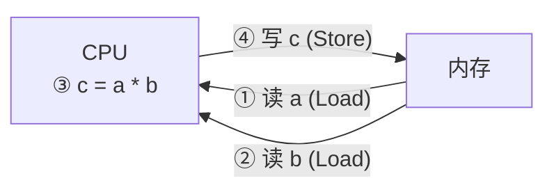

---
tags:
  - arm
---
# 地址空间与 IO 访问

## ARM 架构：统一地址空间

在 ARM 架构中，CPU 并不会区分内存和 IO 设备，它将两者都视为内存。这种方式被称为“存储器映射 IO”（Memory-Mapped I/O）。

这意味着访问一个 IO 设备（如寄存器）的操作，和访问一块内存的操作是完全一样的。

![[03_点亮LED#ARM中怎么访问寄存器？就像访问内存一样]]

![[attachments/04_地址空间、RISC与CISC架构解析/file-20251119160038569.png]]

## X86 架构：独立 IO 空间

与 ARM 不同，X86 架构将内存地址空间和 IO 地址空间分离开来。这种方式被称为“端口映射 IO”（Port-Mapped I/O）或“隔离 IO”（Isolated I/O）。

访问 IO 设备需要使用专门的指令（如 `in` / `out`），而访问内存则使用常规的内存访问指令。

![[attachments/04_地址空间、RISC与CISC架构解析/file-20251119160038571.png]]

# RISC (精简指令集计算机)

RISC (Reduced Instruction Set Computing) 的设计哲学是使用数量较少、功能简单的指令来完成操作。ARM 芯片是 RISC 架构的典型代表。

**核心特点：**
- **简化的内存访问：** 只提供简单的 `Load` (从内存读取到 CPU 寄存器) 和 `Store` (从 CPU 寄存器写入到内存) 指令来访问内存。
- **运算在 CPU 内部：** 所有的数据运算（如加、减、乘、除）都在 CPU 的内部寄存器中进行，而不是直接对内存中的数据操作。
- **设计简单：** CPU 复杂度较低，更易于设计、实现和降低功耗。
- **固定指令长度：** 大部分指令长度固定，便于 CPU 解码和执行。
- **硬布线逻辑与流水线：** 主要采用硬布线逻辑控制，而非复杂的微程序，并大量使用流水线技术来提高执行效率。

下面的流程图展示了 RISC 如何通过多条简单指令完成 `a = a * b` 的操作：

# CISC (复杂指令集计算机)

CISC (Complex Instruction Set Computing) 的设计哲学是提供功能强大、数量繁多的指令，力求用单条指令完成更复杂的操作。X86 架构是 CISC 的典型代表。

**核心特点：**
- **强大的单条指令：** 能够用一条指令完成 RISC 需要多条指令才能完成的复杂任务（例如，直接在内存中完成乘法操作）。
- **设计复杂：** CPU 复杂度高，因为需要支持大量指令和寻址方式。
- **可变指令长度：** 指令长度不固定，增加了 CPU 解码的复杂性。
- **微程序控制：** 大多采用微程序控制技术来实现复杂的指令功能。对于程序员来说，他看不到“微程序”，好像用一条指令就搞定了这一切。
- **多样的寻址方式：** 支持非常丰富的内存寻址方式。

# RISC 与 CISC 比较总结

| 特性 | RISC (精简指令集) | CISC (复杂指令集) |
| :--- | :--- | :--- |
| **设计哲学** | 简单、高效的指令集 | 功能强大、全面的指令集 |
| **指令数量** | 少 | 多 |
| **指令长度** | 固定 | 可变 |
| **内存访问** | 仅 Load/Store 指令 | 很多指令都可以访问内存 |
| **运算方式** | 寄存器-寄存器 | 内存-内存，内存-寄存器 |
| **控制方式** | 硬布线逻辑，流水线 | 微程序控制 |
| **寄存器** | 通用寄存器数量多 | 通用寄存器数量少 |
| **编译器** | 编译器任务重，需优化指令序列 | 编译器任务轻，可直接使用复杂指令 |
| **研制周期** | 短 | 长 |
| **典型代表** | ARM, MIPS, PowerPC | x86, VAX |