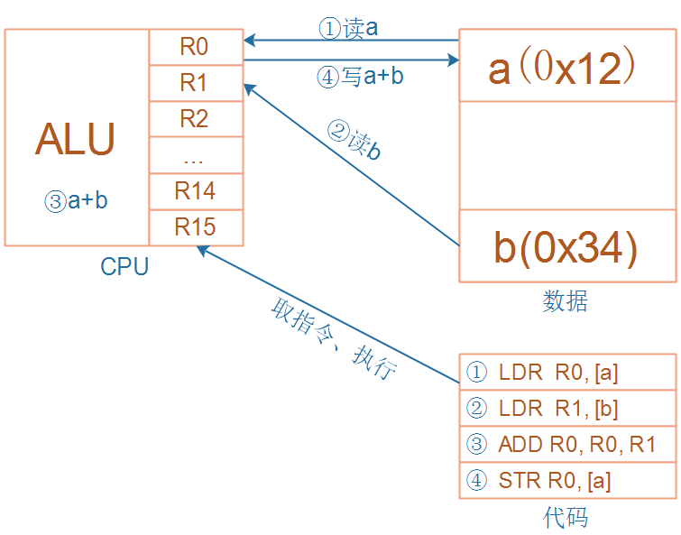
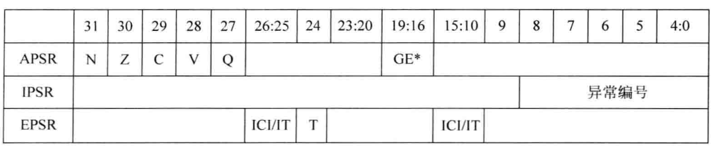

---
tags:
  - arm
  - 寄存器
  - CPU
---

# RISC 指令集与寄存器需求

ARM 芯片属于精简指令集计算机 (RISC)，其指令集有以下特点：
- 对内存只有读 (Load) 和写 (Store) 指令。
- 数据的运算完全在 CPU 内部进行。
- CPU 复杂度低，易于设计。

以 `a = a * b` 这个乘法运算为例，RISC 架构需要通过多条指令分步完成，这个过程清晰地展示了 CPU 与内存的交互，以及对内部存储单元的需求。

这就引出了一个问题：在 CPU 内部，用什么来临时保存从内存读出来的 `a`、`b` 以及计算结果 `a*b` 呢？答案就是**寄存器**。

下图更详细地展示了完成一次运算所需的指令和数据流：CPU 从“代码”区获取指令并执行，从“数据”区读写数据，而 CPU 内部的 ALU (算术逻辑单元) 则使用 R0、R1 等寄存器来暂存操作数和结果。

# ARM 通用寄存器 (R0-R15)

无论是 Cortex-M3/M4 还是 Cortex-A7，其 CPU 内部都有一组核心的寄存器，通常称为通用寄存器。

## Cortex-M3/M4 寄存器组

在 Cortex-M3/M4 中，共有 R0-R15 等寄存器。

- **R0-R12：** 通用寄存器，可用于暂存数据。
- **R13 (SP)：** 栈指针 (Stack Pointer)。它内部有两个物理上的寄存器 SP_main 和 SP_process，但在同一时刻只能使用一个。
- **R14 (LR)：** 链接寄存器 (Link Register)，用于在函数调用时保存返回地址。
- **R15 (PC)：** 程序计数器 (Program Counter)，指向当前正在执行指令的下一条指令地址。直接修改 PC 的值即可实现程序跳转。

## Cortex-A7 寄存器组

作为对比，Cortex-A7 的寄存器组与 M 系列相似，但也有不同之处，尤其是在程序状态寄存器 (PSR) 的命名和实现上。

在更经典的 ARM 架构中，不同处理器模式下（如 User, FIQ, IRQ 等），部分寄存器会有自己的“备份”，这被称为 Banked Registers，以确保在模式切换时关键数据不被破坏。

# 程序状态寄存器 (PSR)

除了通用寄存器，ARM 处理器还有一个非常重要的程序状态寄存器 (PSR)，用于存放程序运行时的各种状态信息。

## Cortex-M3/M4 的 xPSR

在 Cortex-M3/M4 中，程序状态寄存器被称为 xPSR，它实际上是三个独立寄存器的组合视图。

- **APSR (应用PSR):** 存放算术和逻辑运算结果的状态标志，如 N (负)、Z (零)、C (进位)、V (溢出)。
- **IPSR (中断PSR):** 包含当前正在处理的中断或异常编号。
- **EPSR (执行PSR):** 包含一些控制位，如 `T` 位用于指示当前是否处于 Thumb 状态。

这三个寄存器可以被单独访问，也可以通过访问 `xPSR` 来一次性访问它们的组合状态。

下表详细解释了 PSR 中一些状态位的含义：

## Cortex-A7 的 CPSR

在 Cortex-A7 等 A 系列处理器中，这个寄存器被称为 CPSR (Current Program Status Register)。其位域定义与 xPSR 有所不同。

CPSR 中各位的含义如下：

