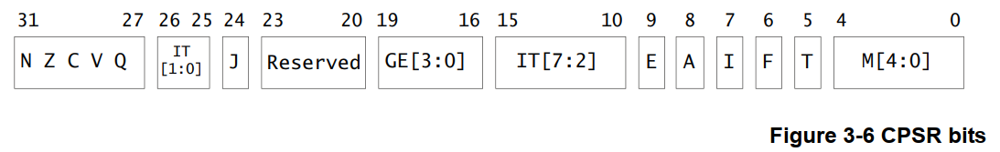

---
tags:
  - ARM
  - 寄存器
  - Cortex-M
  - Cortex-A
---

# 1. ARM 架构与寄存器概述

## 什么是 RISC？

ARM 芯片是一种**精简指令集计算机 (RISC)**。可以通俗地理解为，它只执行一些最核心、最简单的指令，这使得 CPU 的设计可以更简单、更高效。

其主要特点包括：
- **内存访问限制**：只有 `Load`（加载）和 `Store`（存储）指令可以直接访问内存。
- **数据运算在 CPU 内部**：所有的数据计算（如加减乘除）都在 CPU 的寄存器中完成，不能直接对内存中的数据进行运算。

举个例子，执行 `a = a * b` 这个操作，RISC 架构需要四步：
1.  `Load`：从内存读取 a 到 CPU 的一个寄存器（如 R0）。
2.  `Load`：从内存读取 b 到 CPU 的另一个寄存器（如 R1）。
3.  `MUL`：在 CPU 内部，计算 R0 * R1，结果存到 R0。
4.  `Store`：将寄存器 R0 的结果写回内存中的 a。

这个过程中，CPU 内部需要一些空间来临时存放从内存读出来的数据和运算结果，这个“临时空间”就是**寄存器**。

## 寄存器的作用：CPU的数据暂存单元

可以把寄存器想象成 CPU 身边的小黑板，速度极快。CPU 在处理数据时，会先把需要的数据从内存（相当于一个大仓库）搬到这个小黑板上，计算完成后再把结果写回内存。

# 2. 通用寄存器

ARM 处理器有一组非常重要的通用寄存器，编号从 R0 到 R15。

其中，大多数寄存器是“通用的”，但有几个有特殊职责：

- **R0-R12**：是真正的“通用”寄存器，可以随意用来存取数据。
- **R13 (SP)**：**栈指针 (Stack Pointer)**。它始终指向当前程序栈的顶部，用于管理函数的调用和局部变量。
- **R14 (LR)**：**链接寄存器 (Link Register)**。当一个函数被调用时，它负责保存返回地址，以便函数执行完毕后能正确地回到原来的地方。
- **R15 (PC)**：**程序计数器 (Program Counter)**。它存放着下一条即将执行指令的内存地址。改变 PC 的值，就可以实现程序的跳转。

# 3. 程序状态寄存器 (PSR)

除了通用寄存器，ARM 还有一个特殊的状态寄存器，它记录了当前 CPU 的各种状态，例如运算结果是正数、负数还是零，以及 CPU 当前的工作模式等。

## Cortex-M3/M4 架构下的 xPSR

在 Cortex-M3/M4 系列中，程序状态寄存器被称为 **xPSR**。

- **SP_main (主栈指针)**：主要用于操作系统内核和异常处理程序。
- **SP_process (进程栈指针)**：主要用于用户应用程序代码。

xPSR 实际上是三个独立寄存器的组合视图：

- **APSR** (Application PSR)：应用状态寄存器，保存算术和逻辑运算的状态标志（如零标志 Z、进位标志 C）。
- **IPSR** (Interrupt PSR)：中断状态寄存器，记录当前正在处理的中断号。
- **EPSR** (Execution PSR)：执行状态寄存器，包含一些控制 CPU 执行状态的位。

我们可以通过 `MRS` 和 `MSR` 指令来读写这些状态寄存器。

这三个寄存器也可以被看作一个整体，即组合程序状态 (Combined Program Status)。

## Cortex-A7 架构下的 CPSR

在更强大的 Cortex-A 系列（如 A7）中，这个状态寄存器被称为 **CPSR (Current Program Status Register)**。

它的功能更全面，除了包含运算状态，还定义了处理器的工作模式（用户模式、系统模式、中断模式等）和中断使能状态。

# 4. 不同架构寄存器组对比

虽然基本原理相通，但不同系列的 ARM 处理器在寄存器组合上略有差异。

- **Cortex-M3/M4 寄存器视图**
  

- **Cortex-A7 寄存器视图**
  

通过下图可以更直观地看到两者在寄存器组织上的区别。

