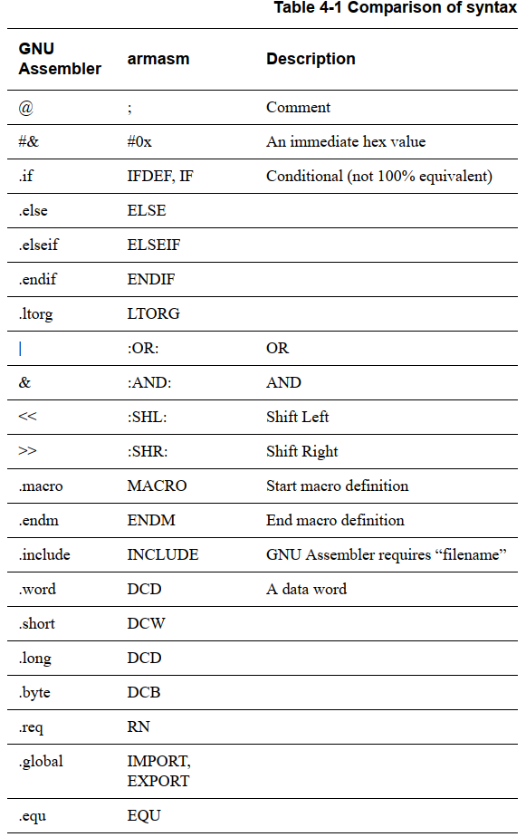

---
tags:
  - ARM
  - 汇编
  - 指令集
---
# ARM、Thumb、Thumb2指令集简介

一开始，ARM公司发布了两类指令集：
*   **ARM指令集**：32位，每条指令占据32位，高效，但是占用空间较大。
*   **Thumb指令集**：16位，每条指令占据16位，节省空间。

为了在效率和空间之间取得平衡，CPU可以在两种模式间切换。通过 [程序状态寄存器 (PSR)](05_ARM处理器核心寄存器详解.md) 中的“T”位来区分当前指令是Thumb指令（T=1）还是ARM指令（T=0）。

假设函数A使用Thumb指令编写，函数B使用ARM指令编写，调用它们时需要切换CPU状态。这通过在跳转到函数地址时，修改PC寄存器（Program Counter）的最低位（BIT0）来实现：
*   调用函数A（Thumb）：`PC = 函数A地址 + 1`（设置BIT0为1）
*   调用函数B（ARM）：`PC = 函数B地址`（保持BIT0为0）

这种方式比较繁琐，因此ARM引入了**Thumb2**指令集，它支持16位和32位指令的混合编程，大大简化了开发。

---

# 统一汇编语言（UAL）

为了屏蔽不同指令集（ARM, Thumb, Thumb2）的复杂性，ARM公司推出了**统一汇编语言（Unified Assembly Language, UAL）**。开发者只需使用UAL语法编写代码，并在程序开头用`CODE32`、`CODE16`或`THUMB`来指定指令集即可。

日常工作中，我们仅需掌握少数核心汇编指令，例如：
*   `MOV`：数据移动
*   `LDR/STR`：单寄存器加载/存储
*   `LDM/STM`：多寄存器加载/存储
*   `AND/OR`：逻辑与/或
*   `ADD/SUB`：加/减
*   `B/BL`：跳转/带链接的跳转
*   `DCD`：分配内存并初始化
*   `ADR/LDR`：地址加载
*   `CMP`：比较

---

# 汇编学习建议

对于大多数嵌入式开发而言，无需精通所有汇编指令。遇到不理解的指令时，通过网络搜索即可快速查明其功能。在实际项目中，复杂的逻辑通常由C语言实现，汇编仅用于启动代码、中断处理等底层场景。

如果希望深入学习，可以参考《ARM Cortex-M3与Cortex-M4权威指南.pdf》。

---

# 汇编指令格式

根据《DEN0013D_cortex_a_series_PG.pdf》和《ARM Cortex-M3与Cortex-M4权威指南.pdf》，汇编指令可以分为几大类：数据处理、内存访问、跳转、饱和运算和其他指令。

其统一汇编语言（UAL）格式通常如下：

*   `Operation`：指令助记符，如`ADD`、`MOV`。
*   `{cond}`：条件码，指令仅在满足特定条件时执行。
*   `{S}`：可选后缀，若存在，指令执行后会更新程序状态寄存器（CPSR）的标志位。
*   `Rd`：目标寄存器，用于存储运算结果。
*   `Rn`, `Operand2`：源操作数。

---

# [数据处理指令](09_ARM数据处理指令详解.md)

数据处理指令用于执行算术和逻辑运算。

**条件码后缀**

大多数ARM指令都可以带条件码执行，这使得代码更高效，避免了不必要的跳转。

---

# [内存访问指令](08_ARM内存访问指令详解.md)

内存访问指令用于在寄存器和内存之间传输数据。

*   **LDR (Load Register)**：从内存加载数据到单个寄存器。
*   **STR (Store Register)**：将单个寄存器的数据存储到内存。
*   **LDM (Load Multiple Registers)**：从内存加载数据到多个寄存器。
*   **STM (Store Multiple Registers)**：将多个寄存器的数据存储到内存。

**LDR 指令语法**

**STR 指令语法**

**LDM 指令语法**

**STM 指令语法**

**地址模式 (addr_mode)**
*   `IA` (Increment After)：传输后增加地址（默认）。
*   `IB` (Increment Before)：传输前增加地址（仅ARM指令）。
*   `DA` (Decrement After)：传输后减少地址（仅ARM指令）。
*   `DB` (Decrement Before)：传输前减少地址。

`!` 后缀表示指令执行后，将新的地址写回基址寄存器 `Rn`。
`^` 后缀表示指令会影响CPSR，通常在异常处理中使用。

---

# [跳转指令](10_ARM跳转指令详解.md)

跳转指令用于改变程序的执行流程。

*   **B (Branch)**：直接跳转到指定地址。
    
*   **BL (Branch with Link)**：在跳转前，将返回地址（下一条指令的地址）保存到链接寄存器（LR）中，常用于函数调用。
    
*   **BX (Branch and eXchange)**：跳转并根据目标地址的最低位切换处理器状态（0=ARM, 1=Thumb）。
    
*   **BLX (Branch with Link and eXchange)**：带返回的跳转并切换状态。
    

---

# **立即数与伪指令**

**立即数**

在ARM指令中，如 `MOV R0, #VAL`，`VAL` 并非可以是任意数值。它必须是一个“立即数”。这是因为指令本身长度有限（16位或32位），无法容纳任意大的常数。

立即数通常是由一个8位数通过偶数位循环移位得到的32位数。

简单来说，**立即数**就是直接写在汇编指令里的数字，比如 `MOV R0, #5` 里的 `5`。但由于ARM指令长度固定，能直接写进指令的立即数是有限制的。这句话的意思是：不是所有数字都能直接作为立即数。只有那些可以通过一个8位的“小数字”，经过“偶数次循环转动”（想象成把这个8位数字的二进制位像轮子一样转动，并且转动的次数必须是偶数）后能得到的32位数字，才能被ARM指令直接识别为立即数。如果一个数字不符合这个规则，你就不能直接把它写在指令里，而需要通过其他方式（比如 `LDR` 伪指令从内存中加载）来使用它。这个限制是为了让指令设计更高效，同时还能覆盖大部分常用的数字。

**LDR 伪指令**

当需要加载一个无法用立即数表示的任意值时，可以使用`LDR`伪指令：
`LDR R0, =VAL`

“伪指令”并非真实的CPU指令，而是由编译器在编译时转换为一条或多条真实指令。
*   如果 `VAL` 是一个合法的立即数，编译器会将其转换为 `MOV R0, #VAL`。
*   如果 `VAL` 不是立即数，编译器会：
    1.  在代码段的某个位置（文字池）存储 `VAL` 的值。
    2.  将伪指令替换为一条基于PC相对寻址的真实`LDR`指令，从文字池中读取该值，如 `LDR R0, [PC, #offset]`。

**ADR 伪指令**

`ADR`（Address）伪指令用于获取一个标号（label）的地址，它通常被编译器转换为一条基于PC的加法或减法指令。
- **标号（Label）** 在汇编语言中是一个符号名称，用于标记内存中的特定位置（通常是指令或数据地址）。它充当地址的占位符，使程序员可以通过名称而非绝对数值地址来引用位置，从而提高代码的可读性和可维护性。汇编器在汇编过程中会将这些标号解析为实际的内存地址。

`ADR R0, Loop`
- 在汇编语言中，`Loop` 通常是一个**标号（Label）**，它标记了代码中的一个特定位置，通常是循环的起始点或一个需要反复跳转到的位置。它是一个符号化的地址，`ADR` 伪指令（或其他跳转指令）可以引用它。

---

# GNU汇编器与armasm语法比较

不同的汇编器（如GNU Assembler和armasm）在语法上存在一些差异。下表列出了一些常见的区别：

