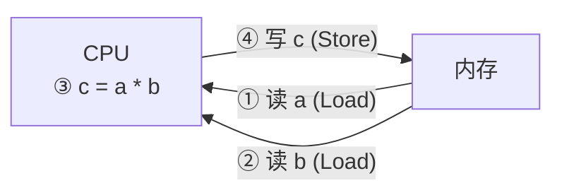

---
tags:
  - ARM
  - 汇编
  - 数据处理指令
  - RISC
---

# 1. RISC 架构与数据处理理念

ARM 芯片属于**精简指令集计算机 (RISC)**，其核心设计哲学之一是**Load-Store 架构**。这意味着：

1.  **内存访问受限**：只有特定的 `LDR` (读内存) 和 `STR` (写内存) 指令可以直接访问内存。
2.  **CPU 内部运算**：所有的数据运算（如加、减、乘、逻辑运算）都必须在 CPU 的通用寄存器之间进行。

这个过程可以概括为“加载-处理-存储”三部曲。例如，要计算 `a = a * b`，RISC 架构需要执行以下步骤：



---

# 2. 数据处理指令的通用语法

ARM 的数据处理指令遵循一个通用的语法格式，这使得指令集非常规整。


*   `Operation`: 指令助记符，如 `ADD`、`SUB`。
*   `{cond}`: 条件执行后缀。如果指定，指令仅在满足特定条件时执行。
*   `{S}`: 更新标志位后缀。如果加上 `S`，指令的执行结果将会影响 APSR (应用层程序状态寄存器) 中的 `N` (负)、`Z` (零)、`C` (进位)、`V` (溢出) 标志位。
*   `Rd`: 目标寄存器，用于存放运算结果。
*   `Rn`: 第一个操作数所在的寄存器。
*   `Operand2`: 第二个操作数，可以是一个立即数，也可以是另一个寄存器。

## 2.1 指令助记符 `Operation`

`Operation` 表示各类汇编指令，比如 `ADD`、`MOV`；如下图


## 2.2 条件执行后缀 `{cond}`

`{cond}` 决定了指令是否执行，它依赖于 APSR 中标志位的当前状态。


---

# 3. 常用数据处理指令

下表列出了一些核心的数据处理指令，它们是汇编编程中最常用的工具。


## 3.1 算术运算指令

*   **`ADD`**: 加法
```arm
ADD  R1, R2, R3         ; R1 = R2 + R3
ADD  R1, R2, #0x12      ; R1 = R2 + 0x12
```
*   **`SUB`**: 减法
```arm
SUB  R1, R2, R3         ; R1 = R2 - R3
SUB  R1, R2, #0x12      ; R1 = R2 - 0x12
```

## 3.2 逻辑运算指令

*   **`AND`**: 位与
```arm
AND  R1, R2, R3         ; R1 = R2 & R3
```
*   **`ORR`**: 位或
```arm
ORR  R1, R2, R3         ; R1 = R2 | R3
```
*   **`BIC`**: 位清除 (Bit Clear)。`BIC R1, R2, R3` 的作用是 `R1 = R2 & (~R3)`，即用 R3 作为掩码，将 R2 中对应的位清零。
```arm
BIC  R1, R2, R3         ; R1 = R2 & ~R3
BIC  R1, R2, #0x10      ; 清除 R2 的第 4 位 (R1 = R2 & ~0x10)
```

## 3.3 比较与测试指令

这类指令不保存运算结果，仅用于设置 APSR 中的条件标志位，通常用于后续的条件跳转。

*   **`CMP`**: 比较。其效果相当于执行 `SUB` 指令，但不保存结果。
```arm
CMP R0, R1              ; 比较 R0 和 R1 (相当于计算 R0 - R1)
CMP R0, #0x12           ; 比较 R0 和 0x12
```
*   **`TST`**: 位测试。其效果相当于执行 `AND` 指令，但不保存结果。常用于测试特定位是 0 还是 1。
```arm
TST  R0, R1             ; 测试 R0 & R1 的结果
TST  R0, #0x10          ; 测试 R0 的第 4 位是否为 1
```

---

# 4. 参考资料

*   《DEN0013D_cortex_a_series_PG.pdf》P70
*   《ARM Cortex-M3与Cortex-M4权威指南.pdf》第5章