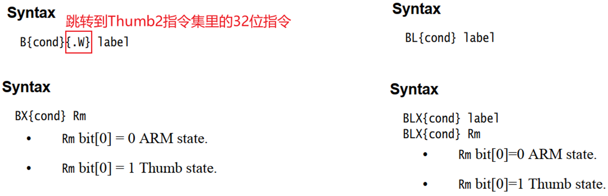

---
tags:
---

# C函数调用与汇编跳转

在C语言中，当一个函数（例如 `A`）调用另一个函数（例如 `B`）时，程序执行的流程会发生跳转。

```c
void A()
{
    int a = 10;
    B(a);
    printf("ok");
}
```

这个过程的本质是：
1.  **跳转**：CPU的执行流程从函数 `A` 的代码区跳转到函数 `B` 的代码区。
2.  **返回**：函数 `B` 执行完毕后，CPU需要能够返回到函数 `A` 中调用 `B` 的下一条指令（即 `printf("ok")`）继续执行。

在汇编语言层面，这个过程就是通过**跳转指令**来实现的。

# ARM跳转指令详解

ARM架构提供了多条跳转指令来满足不同的程序流程控制需求。核心指令包括 `B`、`BL`、`BX` 和 `BLX`。



## B: 分支 (Branch)

`B` 指令是最简单的跳转指令，它会使程序无条件地跳转到指定的目标地址。

特点：
-   只进行跳转，不保存返回地址。
-   适用于不需要返回的场景，例如循环的末尾。

## BL: 带链接的分支 (Branch with Link)

`BL` 指令在跳转前，会将下一条指令的地址（即返回地址）**保存在链接寄存器 `LR`** (Link Register) 中。

特点：
-   跳转前自动保存返回地址到 `LR`。
-   是实现函数调用的标准方式。
-   函数返回时，只需将 `LR` 的值加载回程序计数器 `PC` (Program Counter) 即可。

## BX/BLX: 带状态切换的分支 (Branch and Exchange)

`BX` 和 `BLX` 指令在跳转的同时，还能根据目标地址的最低位（bit 0）来切换处理器的执行状态（ARM状态或Thumb状态）。

-   **目标地址 bit 0 = 0**：处理器切换到 **ARM** 状态。
-   **目标地址 bit 0 = 1**：处理器切换到 **Thumb** 状态。

`BLX` 与 `BX` 的区别在于，`BLX` 在跳转前同样会像 `BL` 一样，将返回地址保存在 `LR` 寄存器中。

# 实战演练

## B 指令示例

下面的代码演示了如何使用 `B` 指令实现一个简单的无限循环。

```arm
Delay:
    MOV  R0, #1000
Loop:
    SUBS R0, R0, #1
    BNE  Loop      ; 如果R0不为0，则跳转回Loop标签
    MOV  R1, #1    ; 这条指令实际上永远不会被执行
```

### BNE指令

`BNE` 是 "Branch if Not Equal" 的缩写，意思是“如果不相等则跳转”。

- **作用**：`BNE` 指令用于在比较结果不相等时，将程序跳转到指定的地址（标签）。
- **判断依据**：它依赖于CPSR（当前程序状态寄存器）中的Z标志位。当Z标志位为0时，表示上一次比较（如`CMP`指令）的结果是“不相等”，此时`BNE`指令就会执行跳转。如果Z标志位为1（表示相等），则`BNE`指令不执行跳转，程序会继续顺序执行下一条指令。

**示例：**

```arm
    CMP R0, #10      ; 比较 R0 和 10
    BNE NotEqual     ; 如果 R0 不等于 10, 则跳转到 NotEqual 标签处
    ; ... 如果 R0 等于 10, 则执行这里的代码 ...
    B End            ; 无条件跳转到 End 标签

NotEqual:
    ; ... 如果 R0 不等于 10, 则执行这里的代码 ...

End:
    ; ... 程序继续 ...
```

在这个例子中，`CMP R0, #10` 会设置Z标志位。如果`R0`的值不为10，Z标志位被清零（Z=0），`BNE NotEqual`就会执行，程序流将跳转到`NotEqual`标签。

## BL 指令示例

此示例展示了如何使用 `BL` 来调用一个子程序（`Delay`），并在结束后返回。

```arm
    BL   Delay     ; 调用Delay子程序，返回地址存入LR
    MOV  R1, #1    ; Delay返回后执行此指令

Delay:
    MOV  R0, #1000
Loop:
    SUBS R0, R0, #1
    BNE  Loop
    MOV  PC, LR    ; 从子程序返回
```

## 直接操作PC寄存器

除了使用跳转指令，我们还可以通过直接修改 `PC` 寄存器的值来实现跳转。`ADR` 是一个伪指令，它能将一个标号的地址加载到寄存器中。

```arm
    ADR  LR, Ret     ; 将Ret的地址（返回地址）加载到LR
    ADR  PC, Delay   ; 将Delay的地址加载到PC，实现跳转

Ret
    MOV  R1, #1

Delay
    MOV  R0, #1000
Loop
    SUBS R0, R0, #1
    BNE  Loop
    MOV  PC, LR      ; 返回
```
