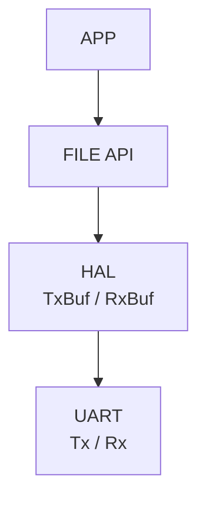
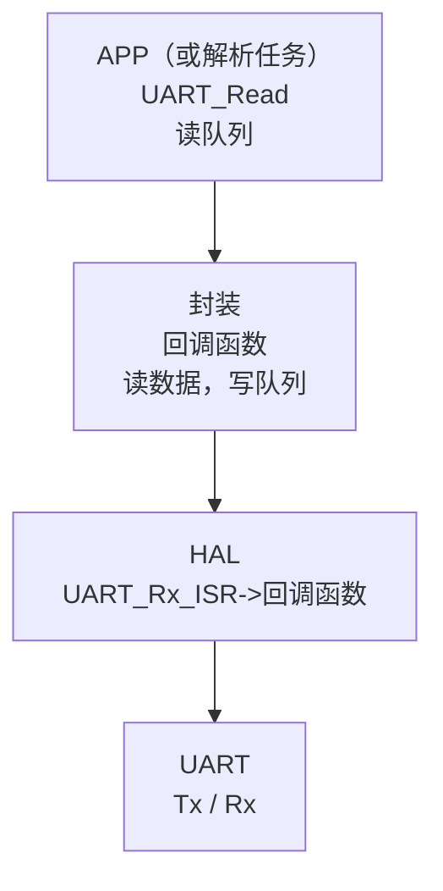

---
tags:
  - freeRTOS
---
 帮我这篇笔记的排版、文字，优化、补充一下，你可以合并、修改。对于代码，你也可以对注释进行修改或者增加注释。使用一级、二级、三级标题分割笔记。如果有错误请帮我修改并注明。最好能将这份笔记整理成即使我很久没看，忘记了，也能一下子看懂的内容。 笔记如下：

---

# 串口的封装

FreeRTOS 中，为什么要封装串口？

- **提高代码可移植性和可扩展性**，方便更换硬件或加入 DMA / 调试输出等功能。
- **精简上层代码**，统一接口如 `Uart_Send()` 让应用层更清晰易维护。

且封装的时候比如封装函数 `(*Send)(...)` 时，为了使使用的人更加简单方便，不应该传入串口的句柄，不要把内部的细节太多的暴露给使用的人。可以使用：

```c
struct UART_Device {
	char *name;
	int (*Init)(...);
	int (*Send)(stract UART_Device *pdev, uint8_t *datas, int len, int timeout);
	int (*Recv)(stract UART_Device *pdev, uint8_t *datas, int timeout);
	void * priv_data;	// 重点
}

struct UART_Device g_uart4_dev = {
	"uart4",
	stm32_uart_init,
	stm32_uart_send,
	stm32_uart_recv,
	&uart4
}

int stm32_uart4_send (struct UART_Device *pdev, ...)
{
	UART_HandleTypedef *handle = pdev->priv_data;
	return HAL_UART_Transmit(handle, ...);
}

...

//	使用
char buf[100] = "www.100ask.net";

g_uart4_dev.stm32_uart_send(&g_uart4_dev, buf, strlen(buf), 100);
//	或者
struct UART_Device *pDev = &g_uart_dev;
pDev->stm32_uart_send(pDev, buf, strlen(buf), 100);
```

这就是面向对象的思想

---

理想情况是使用者使用我们封装的函数时，即使不懂底层原理，也能非常简单地用起来，但是实际工作中，往往会做出一些妥协。

---

假设两个串口同时把数据存在一个 buff

- UART1 <- WiFi1 <- 外网    <- 手机
- UART2 <- WiFi2 <- 局域网 <- 网页

```c
struct UART_Device g_uart1_dev = {
	"uart1",
	stm32_uart_init,
	...,
	stm32_uart_recv,
}

struct UART_Device g_uart2_dev = {
	"uart2",
	stm32_uart_init,
	...,
	stm32_uart_recv,
}

...

//	RTOS

char buf[1000];

task_A ()
{
	获得互斥量 buf_mutex
	g_uart1_dev.stm32_uart_recv(..., buf, 100, ...);
	处理
	释放 buf_mutex
}

task_B ()
{
	获得互斥量 buf_mutex
	g_uart2_dev.stm32_uart_recv(..., buf, 100, ...);
	处理
	释放 buf_mutex
}

// 裸机

char buf[1000];

g_uart1_dev.stm32_uart_recv(..., buf, 100, ...);
处理
g_uart2_dev.stm32_uart_recv(..., buf, 100, ...);
处理
```

在多任务系统里，如果内存足够，一般还是开多个 buff

```c
task_A ()
{
	char buf[1000];
	g_uart1_dev.stm32_uart_recv(..., buf, 100, ...);
	处理
}

task_B ()
{
	char buf[1000];
	g_uart2_dev.stm32_uart_recv(..., buf, 100, ...);
	处理
}
```

# 串口的编程思路

硬件：
- STM32 内存 -> TxFIFO -> 
- STM32 内存 <- RxFIFO <- 

软件（STM32 内存的使用）：
- 驱动：`stm32_uart_recv`
	- 裸机：读环形 buf
	- RTOS：读队列

实现：
- AT 命令的 socket 编程
- 甚至 modbus

---

# RT-Thread串口赏析

RT-Thread 的串口框架采用自下而上的四层设计：
- 底层是 UART 硬件，支持轮询、中断和 DMA 传输；
- 其上是 HAL 驱动层，通过 Tx/Rx 缓冲区与统一 API 实现硬件抽象与异步通信；
- 中间层包含 FinSH 与 AT 组件，共享串口资源以支持命令行调试和模块通信；
- 最上层应用通过 VFS 接口以文件方式操作串口（如 `open("/dev/uart1")`、`read()`、`write()`）。

这种分层抽象实现了硬件无关性、模块化与可扩展性，使串口通信既高效又易用，充分体现了 RT-Thread“简约而不简单”的设计哲学。



# FreeRTOS 串口封装的编程思路



编写代码的重点放在 `UART_Read()` 和 回调函数

---

将原本裸机程序的写环形 buf 改成写队列

```c
/* driver_usart.c */

#if 0
	ring_buffer_write (c, uart3_ringbuffer);
	if (g_fNetInputProcessCallback)
	{
		g_fNetInputProcessCallback(c);
	}
#endif

//	写队列

```

```c
/* main.c */

struct UART_Device *pDev = Get_UART_Device("uart3");

pDev->Init(pDev);	// 在这个函数里面创建队列， Enable UART3IRQ
```

# FreeRTOS的串口封装编程

1. 定义 `UART_Device`

```c
/* uart_device.h */

#ifndef _UART_DEVICE_H
#define _UART_DEVICE_H

struct UART_Device {
	char *name;
	int (*Init)(struct UART_Device *pdev, int baud, int data_bits, char parity, int stop_bits);
	int (*Send)(struct UART_Device *pdev, uint8_t *datas, int len, int timeout_ms);
	int (*Recv)(struct UART_Device *pdev, uint8_t *datas, int timeout_ms);
	void *priv_data;
};

#endif

```

2. 实现 `UART_Device`

```c
/* uart_device.c */

#include "uart_device.h"

extern UART_HandleTypeDef huart1;
extern UART_HandleTypeDef huart3;

struct stm32_uart_data {
	UART_HandleTypeDef *handle;
	QueueHandle_t xRxQueue;
};

static struct stm32_uart_data g_uart1_data= {&huart1, };
struct UART_Device g_uart1_dev = {
	"uart1",
	stm32_uart_init,
	stm32_uart_send,
	stm32_uart_recv,
	&g_uart1_data,
};

static struct stm32_uart_data g_uart3_data= {&huart3, };
struct UART_Device g_uart3_dev = {
	"uart3",
	stm32_uart_init,
	stm32_uart_send,
	stm32_uart_recv,
	&g_uart3_data,
};

struct UART_Device g_uart_devs[] = {&g_uart1_data, &g_uart3_data, ...};

struct UART_Device *GetUARTDevice(char *name)
{
	for (int i = 0; i < sizeof(g_uart_devs)/sizeof(g_uart_devs[0]); i++)
	{
		if (!strcmp(g_uart_devs[i]->name, name))
			return g_uart_devs[i];
	}
	
	return NULL;
};
```

3. 实现函数

```c
/* uart_device.c */

static int stm32_uart_init(struct UART_Device *pdev, int baud, int data_bits, char parity, int stop_bits)
{
	struct stm32_uart_data *uart_data = pdev->priv_data;
	UART_HandleTypeDef *handle = pdev->priv_data;
	
	// 创建队列
	
	
	if (handle == &huart1)
	{
		HAL_NVIC_SetPrtority(UART1_IRQn, 14, 1);
		HAL_NVIC_EnableIRQ(USART1_IRQn);
	}
	else if (handle == &huart3)
	{
		HAL_NVIC_SetPrtority(UART3_IRQn, 14, 1);
		HAL_NVIC_EnableIRQ(USART3_IRQn);
	}
	
	__HAL_UART_ENABLE_IT(handle, UART_IT_RXNE);
}

static int stm32_uart_send(struct UART_Device *pdev, uint8_t *datas, int len, int timeout_ms)
{
}

static int stm32_uart_recv(struct UART_Device *pdev, uint8_t *datas, int timeout_ms)
{
}
```

4. 使用

```c
/* main.c */

pDev->Init(pDev, 115200, 8, 'N', 1,)
```

# Q&A