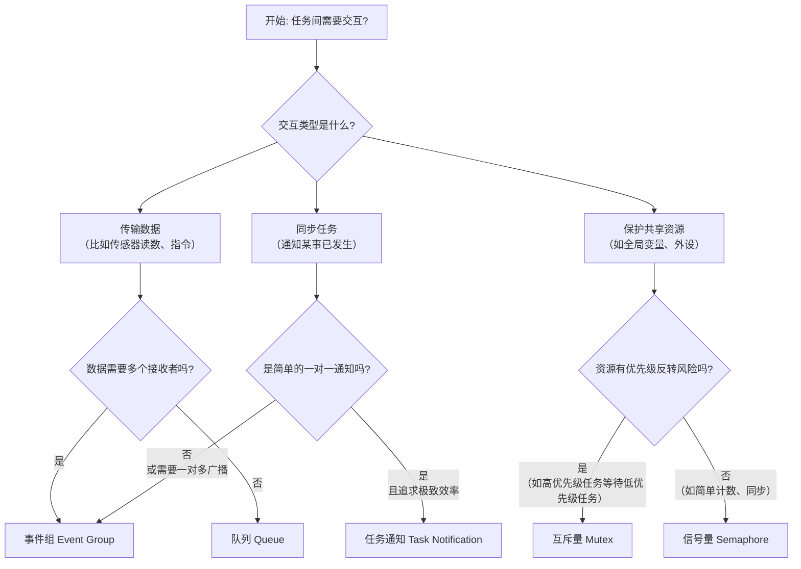

---
tags:
  - freeRTOS
---

### 内核对象选择决策流程图

```mermaid
flowchart TD
A[开始: 任务间需要交互?] --> B{交互类型是什么?};

B --> C[传输数据<br>（比如传感器读数、指令）];
B --> D[同步任务<br>（通知某事已发生）];
B --> E[保护共享资源<br>（如全局变量、外设）];

C --> C_Question{数据需要多个接收者吗?};
C_Question -- 是 --> F[事件组 Event Group];
C_Question -- 否 --> G[队列 Queue];

D --> D_Question{是简单的一对一通知吗?};
D_Question -- 是<br>且追求极致效率 --> H[任务通知 Task Notification];
D_Question -- 否<br>或需要一对多广播 --> F;

E --> E_Question{资源有优先级反转风险吗?};
E_Question -- 是<br>（如高优先级任务等待低优先级任务） --> I[互斥量 Mutex];
E_Question -- 否<br>（如简单计数、同步） --> J[信号量 Semaphore];
```
