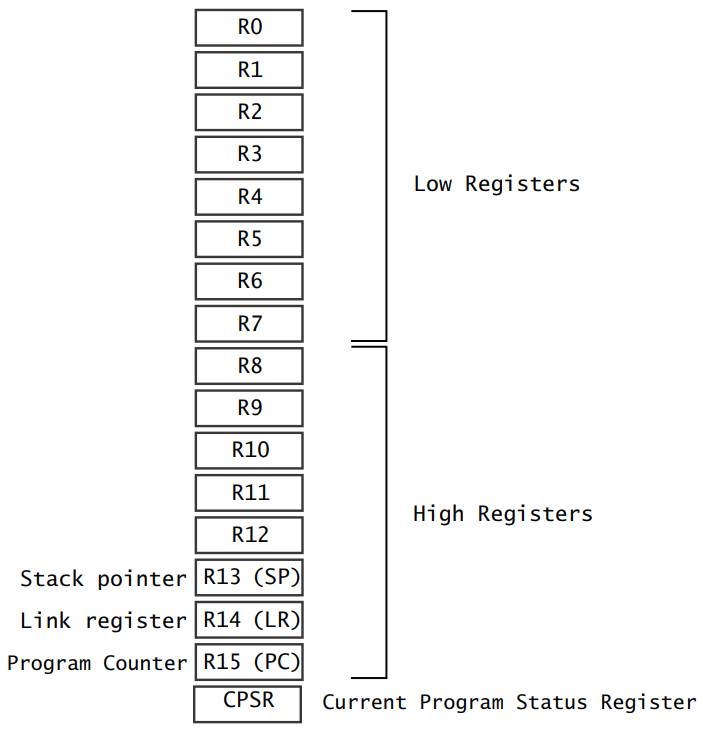
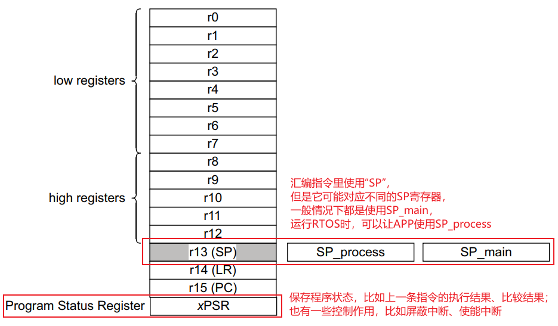
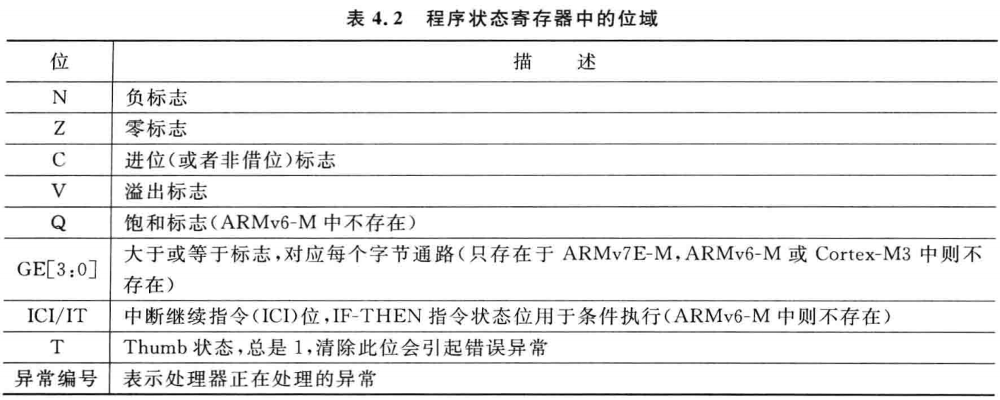
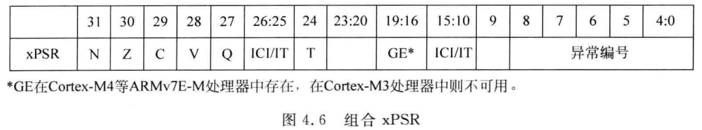

---
tags:
  - 02_ARM内部寄存器
  - Instruction
  - RISC
  - Reduced
---
ARM芯片属于精简指令集计算机(RISC：Reduced Instruction Set Computing)，它所用的指令比较简单，有如下特点：
① 对内存只有读、写指令
② 对于数据的运算是在CPU内部实现
③ 使用RISC指令的CPU复杂度小一点，易于设计

对于左图所示的乘法运算a = a * b，
在RISC中要使用4条汇编指令：
① 读内存a
② 读内存b
③ 计算a*b
④ 把结果写入内存

---

对于左图所示的乘法运算a = a * b，
在RISC中要使用4条汇编指令：
① 读内存a
② 读内存b
③ 计算a*b
④ 把结果写入内存
问题：
在CPU内部，用什么来保存a、b、a*b ？

---

无论是cortex-M3/M4，
还是cortex-A7，
CPU内部都有R0、R1、……、R15寄存器；
它们可以用来“暂存”数据。

对于R13、R14、R15，还另有用途：
R13：别名SP(Stack Pointer)，栈指针
R14：别名LR(Link Register)，用来保存返回地址
R15：别名PC(Program Counter)，程序计数器，
         表示当前指令地址，写入新值即可跳转

---

cortex-M3/M4：
作为对比，cortex-A7也是类似的：

---

cortex-A7：

---

对于cortex-M3/M4，
还要一个Program Status Register

---

对于cortex-M3/M4来说，
xPSR实际上对应3个寄存器：
① APSR：Application PSR，应用PSR
② IPSR：Interrupt PSR，中断PSR
③ EPSR：Exectution PSR，执行PSR
这3个寄存器的含义如右图所示

这3个寄存器，可以单独访问：
MRS  R0, APSR  ;读APSR
MRS  R0, IPSR    ;读IPSR
MSR  APSR, R0   ;写APSR

这3个寄存器，也可以一次性访问：
MRS  R0,  PSR  ; 读组合程序状态
MSR  PSR, R0   ; 写组合程序状态
所谓组合程序状态，入下图所示：

---

对于cortex-A7，
还要一个Current Program Status Register

