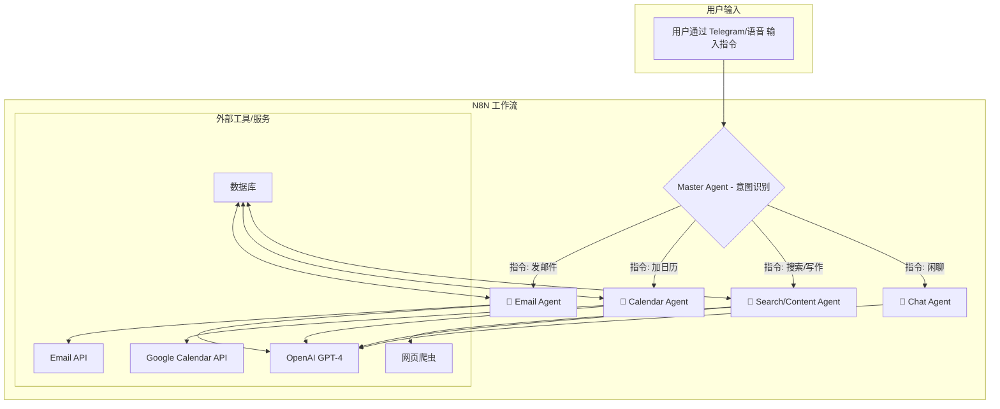

> 这是一份基于视频《最完整的N8N自动化9小时全套教学！（从新手到高手）》内容的深度优化笔记。
> 
> 由于视频长达9小时，本笔记重点整理了视频开头的**核心案例（AI全能私人助手）**、**架构设计逻辑**以及关键技术节点，并增加了实践代码，以方便你在Obsidian中高效学习和查阅。

---

# N8N 自动化全套教程笔记 (李哈利 Harry)

## 什么是 N8N？
N8N (发音同 "n-eight-n") 是一个开源、可视化的工作流自动化工具。它允许你连接不同的应用程序和服务（如 OpenAI, Google Calendar, Telegram, 数据库等），通过一个图形化的“节点”编辑器来创建复杂的自动化流程，而无需编写大量代码。你可以把它看作是可自部署、功能更强大的 Zapier 或 Make。

## 1. 课程简介与目标 [[00:00](http://www.youtube.com/watch?v=JnepOnstpAQ&t=0)]

- **适用人群**: 新手小白、希望通过AI增效降本的中小企业主、AI自动化领域的自由职业者。
- **涵盖领域**: 个人助理、RAG（检索增强生成）、MCP、自媒体自动化、本地部署等。
- **核心价值**: 
	> 并非简单的工具拼接，而是构建完整的、可解决实际问题的解决方案，例如帮企业节省数万元的人工成本。

## 2. 核心案例：AI超级私人助手 [[01:45](http://www.youtube.com/watch?v=JnepOnstpAQ&t=105)]

此项目演示了一个多功能AI Agent如何通过自然语言（文字或语音）处理复杂任务。

### 功能展示

1. **邮件自动发送** `[[02:00](http://www.youtube.com/watch?v=JnepOnstpAQ&t=120)]`
    - **指令**: 在Telegram中输入 _"Send an email to Harry invite to have a dinner tomorrow 6 PM"_。
    - **流程**: N8N接收指令 → 调用ChatGPT生成邮件草稿 → 自动发送邮件 → 返回确认信息至Telegram。
        
2. **上下文理解与语音控制** `[[02:46](http://www.youtube.com/watch?v=JnepOnstpAQ&t=166)]`
    - **指令**: 发送一条中文**语音消息**：_"明天的那个晚宴帮我加到日历里"_。
    - **能力**: AI不仅通过Speech-to-Text识别了语音，还**记住了上一轮对话的上下文**，实现了多轮对话的逻辑关联。
        
3. **日历集成 (Google Calendar)** `[[03:33](http://www.youtube.com/watch?v=JnepOnstpAQ&t=213)]`
    - **结果**: AI自动提取时间（明天、6点到7点半），在日历中创建了 _"Dinner with Harry"_ 的日程。
        
4. **数据库查询** `[[03:52](http://www.youtube.com/watch?v=JnepOnstpAQ&t=232)]`
    - **指令**: 询问 _"Can you give me Bob's email?"_
    - **流程**: AI连接到预设的数据库（Database），检索特定联系人的信息并返回。
        
5. **Web爬虫与内容创作** `[[04:37](http://www.youtube.com/watch?v=JnepOnstpAQ&t=277)]`
    - **指令**: _"Write me a blog about CrossFit"_。
    - **流程**: `Search Agent`爬取实时网页数据 → 学习整理 → 交给ChatGPT撰写博客 → 返回结果。

### 架构解析：多智能体系统 (Multi-Agent Architecture) [[05:00](http://www.youtube.com/watch?v=JnepOnstpAQ&t=300)]

该项目的核心是分层架构，而非单一的巨型Prompt。

- **主路由 Agent (Master Agent)**: 负责接收用户所有指令，进行**意图识别**（Intent Recognition），然后将任务分发给最合适的子Agent。
    
- **子智能体 (Sub-Agents)**: 各司其职，处理专门任务。
    - **📧 Email Agent**: 负责邮件撰写和发送。
    - **📅 Calendar Agent**: 负责日程管理。
    - **💬 Chat Agent**: 负责常规闲聊对话。
    - **🔎 Search/Content Agent**: 负责联网搜索和长文写作。

## 3. 关键实操步骤与技术点

### 起步阶段

- **[[07:16](http://www.youtube.com/watch?v=JnepOnstpAQ&t=436)] 注册与模板导入**:
    - 在 N8N 官网注册账号。
    - 通过 `Import from file` 导入现成 Workflow 模板，**修改而非从零创造**是最高效的学习方式。

### 搭建过程

- **[[38:32](http://www.youtube.com/watch?v=JnepOnstpAQ&t=2312)] 从零重建个人助手**:
    - 设置**系统提示词 (System Prompt)**，定义助手的角色和用户信息（邮箱、国家等），让AI知道为谁服务。
- **[[01:03:05](http://www.youtube.com/watch?v=JnepOnstpAQ&t=3785)] WhatsApp API 集成**:
    - 需在 Meta Developers 后台获取 `Access Token` 和 `Phone Number ID`。
- **[[01:13:09](http://www.youtube.com/watch?v=JnepOnstpAQ&t=4389)] 子工作流 (Sub-workflow) 调用**:
    - 这是实现Agent架构的关键，在一个画布中通过 `Tool` 调用另一个 Workflow。
- **[[01:25:55](http://www.youtube.com/watch?v=JnepOnstpAQ&t=5155)] 记忆功能 (Memory)**:
    - **生产环境**: 强烈建议使用 `PostgreSQL` 数据库存储对话历史，实现长期记忆。
    - **简单测试**: 可用N8N自带的内存机制（`N8N Built-in Memory`）。
- **[[02:01:02](http://www.youtube.com/watch?v=JnepOnstpAQ&t=7262)] 安全性：环境变量**:
    > **[!] 重要**: 绝不要在节点中直接硬编码 API Key。应使用 N8N 的 `Credentials` 或环境变量功能，确保密钥安全。

## 4. 总结与行动建议 [09:08:36](http://www.youtube.com/watch?v=JnepOnstpAQ&t=32916)

- **必须执行**:
  > 看完教程只是第一步，必须动手执行。哪怕只是下载模板跑通一个最简单的流程，也比只看不做强百倍。
- **职业发展**: 掌握 N8N 和 AI Agent 搭建是成为企业数字化人才或开启副业的关键技能。
- **进阶资源**: 视频最后提到了其 VIP 社区（AI Agent大师学院），提供更深度的支持。

---

## Obsidian 实践建议 (为你定制)

### 1. 将 Multi-Agent 架构可视化

直接在你的笔记中复制以下代码块，即可用Mermaid插件生成清晰的架构图。

### 2. 结合你的电子信息背景

视频中的API调用和数据库概念对你来说是优势。你可以尝试一个非常酷的软硬件结合项目：

- **项目构想**: `智能家居/实验室环境监控 + AI助理`
- **硬件端 (ESP32/STM32)**:
    - 使用 FreeRTOS 调度任务，采集传感器数据（如温湿度、光照）。
    - 通过 `MQTT` 协议将数据定时上报到云端 MQTT Broker。
- **N8N 端 (软件/云)**:
    - 创建一个 N8N Workflow，触发器设置为订阅 `MQTT` 主题。
    - 接收到数据后，进行处理（例如，判断温度是否超标）。
    - **AI 集成**: 如果超标，调用 `OpenAI Node` 生成一段警告信息。
    - **通知**: 将警告信息通过 `Telegram Bot` 或 `Email` 发送给你。
    - **数据存储**: 同时将每一次的数据记录到 `Google Sheets` 或 `Postgres` 数据库中。

这个项目不仅能巩固你的 N8N 技能，还能完美结合你的专业知识，成为一个亮眼的毕业设计或个人作品。