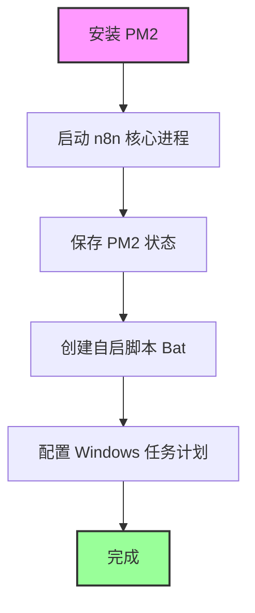

---
tags:
  - n8n
  - pm2
  - nodejs
  - automation
  - cli
---

**标签:** #n8n #PM2 #Windows #自动化 #效率工具
**状态:** ✅ 已配置

## 1. 背景
在 Windows 环境下，直接使用 CMD 运行 `n8n` 会导致关闭窗口后服务停止。为了实现 **后台静默运行** 和 **开机自动启动**，使用 Node.js 的进程管理工具 **PM2** 配合 Windows 任务计划程序是最稳定的方案。

## 2. 核心流程图 (Mermaid)



## 3. 配置步骤

### 第一步：安装 PM2

如果尚未安装，在 CMD/PowerShell 中运行：

PowerShell

```
npm install pm2 -g
```

### 第二步：启动 n8n (避坑指南)

**注意：** 不能直接运行 `pm2 start n8n`，因为 Windows 下 PM2 无法解析 `.cmd` 快捷方式，需直接指向 JS 核心文件。

**执行命令：**

PowerShell

```
pm2 start "C:\Users\13822\AppData\Roaming\npm\node_modules\n8n\bin\n8n" --name n8n_flow
```

> 💡 **路径说明：** 该路径对应当前用户 `13822`。若迁移电脑，需修改用户名部分。

**检查状态：**

PowerShell

```
pm2 status
```

_确保状态 (status) 显示为绿色 `online`。_

### 第三步：保存当前进程列表

这一步将当前运行的 n8n 记录到 PM2 的转存文件中：

PowerShell

```
pm2 save
```

### 第四步：配置开机自启 (Task Scheduler)

由于 `pm2 startup` 在 Windows 上兼容性不佳，需手动设置。

1. **创建脚本文件：**
    
    - 新建文件：`start_n8n_pm2.bat` (建议存放在 `C:\Users\13822\` 目录下)。
        
    - 文件内容：
        
        代码段
        
        ```
        pm2 resurrect
        ```
        
        _(注：`pm2 resurrect` 会复活之前 `save` 过的进程列表)_
        
2. **设置任务计划程序：**
    
    - 搜索并打开 **"任务计划程序" (Task Scheduler)**。
        
    - 点击 **"创建基本任务"** -> 命名为 `PM2 AutoStart`。
        
    - **触发器：** 选择 "当计算机启动时"。
        
    - **操作：** 选择 "启动程序"。
        
    - **程序/脚本：** 选择上述创建的 `start_n8n_pm2.bat` 文件。
        
    - 完成设置。
        

---

## 4. 常用管理命令

|**功能**|**命令**|**说明**|
|---|---|---|
|**查看状态**|`pm2 status`|查看 CPU/内存占用及运行状态|
|**查看日志**|`pm2 logs n8n_flow`|排查报错信息|
|**重启服务**|`pm2 restart n8n_flow`|修改配置后需重启|
|**停止服务**|`pm2 stop n8n_flow`|暂时停止运行|
|**保存更改**|`pm2 save`|**重要：** 任何增删改操作后必须执行|

---

## 5. 如何关闭开机自启

如果未来不再需要自动运行，请按以下顺序操作：

1. **删除 PM2 进程：**
    
    PowerShell
    
    ```
    pm2 delete n8n_flow
    pm2 save
    ```
    
    _(执行 `save` 是为了更新转存文件，确保下次 `resurrect` 时列表为空)_
    
2. **禁用 Windows 任务：**
    
    - 打开 **任务计划程序**。
        
    - 找到 `PM2 AutoStart` 任务。
        
    - 右键点击 -> **禁用** 或 **删除**。
        

---

## 6. 故障排查记录

- **问题：** 运行 `pm2 start n8n` 报错 `SyntaxError` 和 `@ECHO off`。
    
- **原因：** PM2 错误地尝试用 Node 解析 Windows 的 `.cmd` 批处理文件。
    
- **解决：** 指定了 `node_modules` 下具体的 JS 文件路径来启动。
    

```

***

### 💡 给您的建议

1.  **Mermaid 语法：** 我已经按照您的要求，确保 Mermaid 图表中没有使用中文标点，以防 Obsidian 渲染出错。
2.  **路径备份：** 笔记中记录了您电脑上的绝对路径，这非常重要，以后如果重装系统或更换电脑，记得要更新笔记中的路径（特别是用户名 `13822` 部分）。

您现在可以将这段内容复制进 Obsidian 了。如果还有其他关于 n8n 配置的问题，随时告诉我！
```