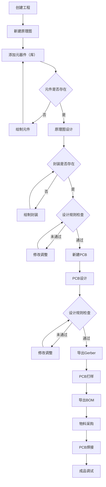

---
tags:
  - pcb
  - stm32
---
# 主流 PCB 设计软件

- Altium Designer、 Protel
- Cadence Allegro、 OrCAD
- PADS
- KiCad、 立创 EDA

# PCB 设计流程

# STM32单片机最小系统

- MCU 本体
- 电源电路（VCC、GND、去耦电容等）
- 时钟电路（外部晶振/内部RC、负载电容等）
- 复位电路（NRST按键、电阻、电容）
- 下载接口（SWD/JTAG/UART）
- 启动模式选择（BOOT0、BOOT1引脚配置）

## 电源电路

- ![[单片机最小系统.png]]
- **标准工作电压 (VDD)**：数字逻辑的主电源，2.0–3.6V，常用 3.3V。
- **模拟工作电压 (VDDA)**：模拟外设的电源（ADC/DAC），通常接 3.3V 并滤波。
- **基准参考电压 (VREF+ / VREF−)**：ADC/DAC 的“尺子刻度”，默认用 VDDA，精度要求高可外接基准源。（注意：C8T6 是没有的，引脚多的就有）
- **RTC 备用电源 (VBAT)**：给 RTC 和备份寄存器供电的独立引脚，常接纽扣电池/超级电容断电保持时间。
- ![[04_A/STM32/pdf/STM32F103xE数据手册.pdf#page=44&rect=123,427,528,516|STM32F103xE数据手册, p.44]]
- ![[STM32F103_CORE.pdf#page=1&rect=33,164,306,405|STM32F103_CORE, p.1]]

### 电源转换

![[电源转换.png]]

- 12V 转 5V 建议使用 DC-DC
- 5V 转 3.3V 建议使用 LDO

- ![[STM32F103_CORE.pdf#page=1&rect=49,416,442,552&color=note|STM32F103_CORE, p.1]]

## 时钟电路

- 高速时钟源设计
	- ![[04_A/STM32/pdf/STM32F103xE数据手册.pdf#page=60&rect=120,130,529,370&color=note|📖]]
	- ![[STM32F103_CORE.pdf#page=1&rect=356,287,446,383&color=note|📖]]
- 低速时钟源设计
	- ![[04_A/STM32/pdf/STM32F103xE数据手册.pdf#page=61&rect=116,245,528,297&color=note|📖]]
	- ![[04_A/STM32/pdf/STM32F103xE数据手册.pdf#page=62&rect=120,600,533,762&color=note|📖]]
	- ![[STM32F103_CORE.pdf#page=1&rect=355,173,446,270&color=note|📖]]

## 复位电路

- ![[04_A/STM32/pdf/STM32F103xE数据手册.pdf#page=95&rect=121,598,533,759&color=note|📖]]
- ![[STM32F103_CORE.pdf#page=1&rect=325,49,449,153&color=note|📖]]

## 下载接口

- ![[04_A/STM32/pdf/STM32F103xE数据手册.pdf#page=24&rect=52,595,526,678&color=note|STM32F103xE数据手册, p.24]]
- ![[STM32F103xx参考手册(英文原版).pdf#page=176&rect=124,232,528,340|STM32F103xx参考手册(英文原版), p.176]]
- ![[STM32F103_CORE.pdf#page=1&rect=505,299,612,406&color=note|STM32F103_CORE, p.1]]

## 启动模式选择

- ![[04_A/STM32/pdf/STM32F103xE数据手册.pdf#page=17&rect=113,618,534,757&color=note|📖]]
- ![[STM32F103xx参考手册(英文原版).pdf#page=60&rect=53,176,536,357&color=note|STM32F103xx参考手册(英文原版), p.60]]
- ![[STM32F103_CORE.pdf#page=1&rect=650,438,815,549&color=note|STM32F103_CORE, p.1]]

# 按步骤创建

1. 创建工程，依次添加：原理图文件、PCB 文件、原理图库、PCB 库
2. 原理图元件图的来源？封装库+自己画
3. 理解原理图原件与实物的联系
4. 提交原理图库文件，相互审核